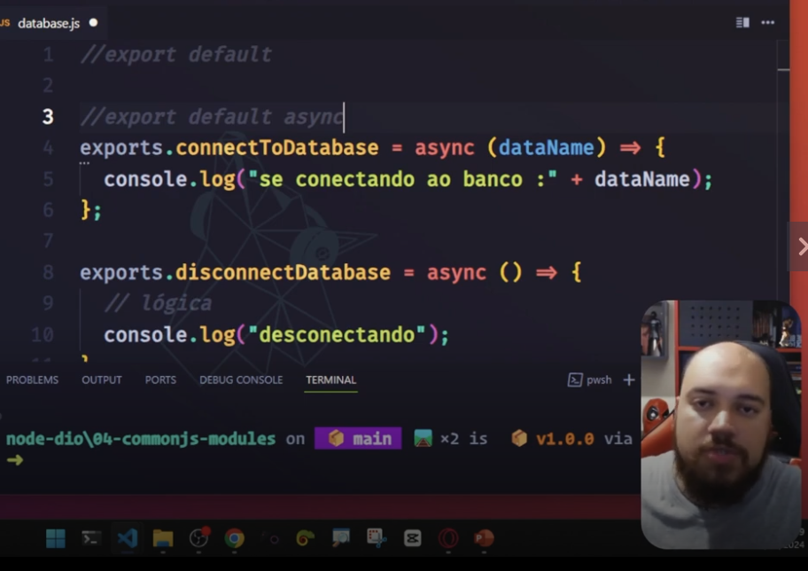
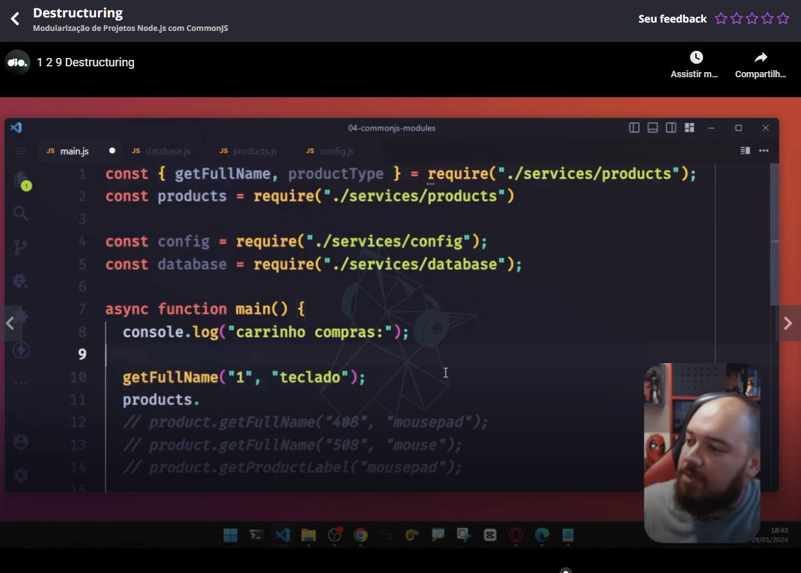

# Introduction


ESM Modules are more newer.


Teacher talked that we will see more examples in the course related to ESM, but CommonJS (cjs) is still important to learn and the difference in performance is only a little better when using ESM modules.

OBS: Please the tests in the directory "tests".


# Running the main script of the package.json

I explained this question in [this video](https://www.youtube.com/watch?v=m-jJNJCgMQc)


# Exporting two fuctions

Please see the files in the folder tests/exporting-2-functions


# Exporting constants

You can also export a constant, you can do this that same way you export a function, but you have only to export a constant.


# Ways to export

You can export only an item, example:

```
const item = "Bola"
module.exports = item
```

Or more than a item:

```
const name = "Enzo"
const age = 5
module.exports = {
    name: name,
    age: age
}
```

If you will export a value which key is the same of the name of the variable, you can ommit the key on export:

```
const name = "Enzo"
const age = 5
module.exports = {
    name,
    age:
}
```


# Hidden functions

A hidden function is a non exported function. You can have this type of function to use inside the module, as example in an exported function.


# Export default

One way to do this you can see in this next image:


And to use this syntax with the async keyword, please see the place where to put the keyword "async". Is not in the beginning of the line:




# Destructuring

If you wanna to use only some functions/constants of a module, you can use the "destructure" syntax:




# Slides of the class

[link](https://hermes.dio.me/files/assets/0d9f3b1d-ad86-44e8-927a-4322c486e910.pptx)


# Teacher files related to the class

[link](https://github.com/digitalinnovationone/formacao-nodejs/tree/main/04-commonjs-modules)
